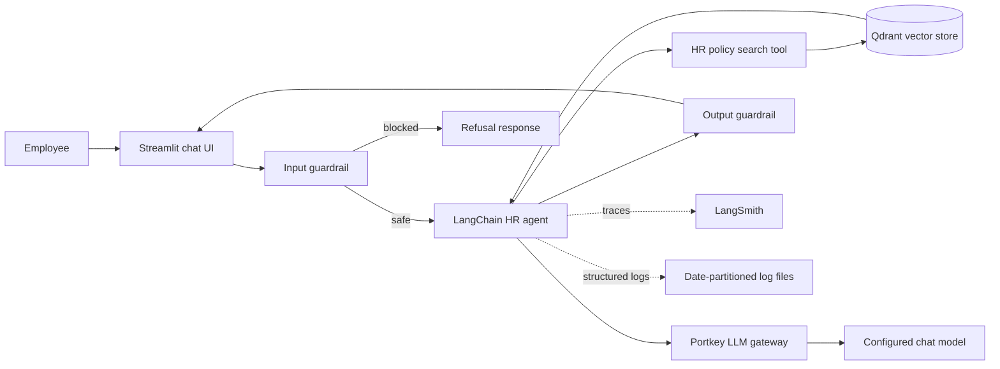

# Enterprise RAG with Security System

Production-oriented HR policy assistant built with retrieval-augmented generation (RAG). The system answers employee questions from an approved HR policy document while enforcing input and output security checks, routing model traffic through an LLM gateway, emitting operational logs, supporting distributed tracing, and evaluating answer quality with a repeatable test dataset.

## Why This Project Exists

Enterprise knowledge assistants have to do more than generate fluent text. They must retrieve the right source, avoid inventing policy, protect sensitive information, and provide enough operational evidence to debug and improve the system.

This project addresses common HR support problems:

- **Slow, repetitive support:** Employees repeatedly ask HR teams about leave, sick days, work from home, probation, notice periods, reimbursement, holidays, and exit processes.
- **Inconsistent answers:** Policy information can be paraphrased differently by different people or become detached from the approved source.
- **Hallucination risk:** A language model may confidently answer when the policy does not contain the required fact.
- **Security and privacy exposure:** Users may attempt prompt injection, request another employee's personal data, or receive an unsafe answer containing a credential, suspicious link, private data, or unauthorized promise.
- **Limited production visibility:** Without logs, traces, and evaluation results, it is difficult to understand failures, latency, retrieval quality, or regressions after a model or policy change.

## Solution

The assistant converts the HR policy document into searchable chunks and stores their embeddings in Qdrant. For each question, a LangChain agent uses a policy search tool to retrieve relevant context before generating an answer. The request is screened before it reaches the agent and the answer is screened again before it reaches the user.



## Security System

Security is part of the request path, rather than a separate demonstration feature.

- **Input policy enforcement:** A dedicated safeguard model classifies prompts for prompt injection, jailbreak attempts, and requests for another employee's private, medical, or salary information.
- **Output policy enforcement:** Generated answers are classified for PII leakage, unauthorized approvals or promises, discriminatory or toxic language, suspicious links, and credentials.
- **Fail-closed user experience:** Unsafe input or output returns a neutral refusal message instead of exposing the model response.
- **Role-constrained agent:** The system prompt requires the agent to use the HR policy search tool and to say it does not know when the answer is not supported by retrieved policy.
- **Gateway-based model access:** Portkey centralizes provider routing and keeps the application integration independent from the upstream model endpoint.
- **Secret configuration:** API keys and service configuration are loaded from environment variables through `python-dotenv`; secrets are not hard-coded in the application.

The current guardrails are model-based classifiers. A production deployment should complement them with identity-aware authorization, tenant isolation, encrypted secret management, rate limiting, prompt and response redaction, and an approved-data governance process.

## Observability and Monitoring

The project includes the foundations required to operate and troubleshoot an LLM application:

- **Structured application logging:** Python logging records lifecycle events, model and vector-store setup, questions, guardrail blocks, and final answers.
- **Run-based log retention:** Logs are written to `logs/YYYY-MM-DD/run_HHMMSS.log`, making individual executions easy to isolate during incident analysis.
- **Optional LangSmith tracing:** Set `LANGSMITH_TRACING=true` to trace LangChain runs in the configured LangSmith project.
- **Gateway visibility:** LLM calls are routed through Portkey, providing a central control point for provider routing and gateway-level observability.
- **Retrieval visibility:** The evaluation path captures the exact chunks retrieved for each question so groundedness can be assessed against source context, not only against a reference answer.

For a full production rollout, connect logs and traces to a centralized monitoring platform and add alerts for error rate, latency, token spend, guardrail block rate, retrieval failures, and evaluation-score regression.

## Evaluation

Quality is evaluated as a repeatable experiment instead of being judged only by manual demos.

- A LangSmith dataset named `hr-policy-qna` contains representative questions and expected answers.
- The evaluation target runs the real assistant pipeline and captures both the final answer and retrieved context.
- `OpenEvals` LLM-as-judge evaluators measure **correctness** and **RAG groundedness**.
- The groundedness evaluator checks whether the response is supported by the retrieved policy chunks, helping detect unsupported claims and hallucinations.
- Evaluation experiments are sent to LangSmith for comparison as prompts, models, retrieval settings, or policy documents change.

Run the evaluation with:

```bash
python evaluate.py
```

## What Makes It Different

Many RAG demos stop at “retrieve documents and generate an answer.” This project treats the assistant as an enterprise system with controls around the model:

1. **Security at both boundaries:** User input and model output are independently inspected.
2. **Grounded answers by design:** The agent must search the policy source and must not guess beyond retrieved evidence.
3. **Provider abstraction:** Portkey provides a gateway layer between application code and the model provider.
4. **Operational evidence:** Logs, optional traces, and captured retrieval context make behavior inspectable.
5. **Measurable quality:** Correctness and groundedness are evaluated against a reusable dataset.
6. **Clear domain scope:** The assistant is constrained to an HR policy use case, making its policies, tests, and failure modes explicit.

## Tools and Technologies

| Area | Technology | Purpose |
| --- | --- | --- |
| User interface | Streamlit | Interactive employee chat experience |
| Agent framework | LangChain | Tool-using HR assistant orchestration |
| LLM gateway | Portkey | Provider routing and centralized model access |
| Chat models | Configured OpenAI-compatible model and Groq guard model | Answer generation and safety classification |
| Embeddings | Jina Embeddings v2 Base EN | Convert HR policy chunks into vectors |
| Vector database | Qdrant | Semantic storage and retrieval |
| Evaluation | LangSmith and OpenEvals | Dataset management, experiments, correctness, and groundedness |
| Observability | Python logging and LangSmith tracing | Runtime logs and optional execution traces |
| Configuration | `python-dotenv` | Environment-based configuration and secret loading |
| Packaging and deployment | `requirements.txt`, Dockerfile | Reproducible dependencies and containerization |

## Project Structure

```text
.
├── app.py                         # Streamlit application
├── evaluate.py                    # Evaluation entry point
├── main.py                        # CLI demonstration
├── requirements.txt               # Python dependencies
├── Dockerfile                     # Container definition
├── data/hr_policy.txt             # Source HR policy document
├── hr_assistant/
│   ├── agent.py                   # LangChain agent definition
│   ├── config.py                  # Environment and model configuration
│   ├── document_loader.py         # Source document loading
│   ├── embeddings.py              # Embedding model setup
│   ├── evaluation.py              # LangSmith/OpenEvals workflow
│   ├── gateway.py                 # Portkey LLM gateway client
│   ├── guardrails.py              # Input and output safety policies
│   ├── logger.py                  # Date-partitioned logging
│   ├── pipeline.py                # End-to-end assistant orchestration
│   ├── splitter.py                # Document chunking
│   ├── tools.py                   # HR policy retrieval tool
│   ├── tracing.py                 # LangSmith tracing status
│   └── vector_store.py            # Qdrant indexing and retrieval
└── logs/                          # Runtime logs generated by the application
```

## Local Setup

### 1. Create an environment

Python 3.13 is used by the included development environment. Python 3.11+ is recommended.

```bash
python -m venv .venv
source .venv/bin/activate
pip install -r requirements.txt
```

### 2. Configure environment variables

Create a `.env` file in the project root:

```dotenv
GROQ_API_KEY=your_groq_api_key
JINA_API_KEY=your_jina_api_key
PORTKEY_API_KEY=your_portkey_api_key
QDRANT_URL=https://your-qdrant-instance
QDRANT_API_KEY=your_qdrant_api_key
QDRANT_COLLECTION_NAME=hr_policy

# Optional LangSmith tracing and evaluation
LANGSMITH_TRACING=true
LANGSMITH_API_KEY=your_langsmith_api_key
LANGSMITH_PROJECT=enterprise-hr-rag
LANGSMITH_ENDPOINT=https://api.smith.langchain.com
```

Do not commit `.env` or real credentials. The application currently validates `GROQ_API_KEY` and `JINA_API_KEY` at startup; the remaining integrations also need their corresponding values to function.

### 3. Start the application

```bash
streamlit run app.py
```

On first startup, the application loads `data/hr_policy.txt`, splits it into chunks, creates embeddings, and indexes them in the configured Qdrant collection. Later runs reuse the existing collection when it is available.

### 4. Run the CLI demo

```bash
python main.py
```

## Production Readiness Checklist

- Use a managed secrets solution instead of local `.env` files.
- Add authentication and authorization before exposing the chat endpoint.
- Enforce tenant and document-level access controls for multi-tenant use.
- Centralize logs and traces, with PII-aware redaction and retention policies.
- Add service metrics and alerts for latency, failures, spend, retrieval quality, and guardrail decisions.
- Version policy documents, embeddings, prompts, and evaluation datasets.
- Run evaluation gates in CI/CD before deploying model, prompt, or retrieval changes.
- Add automated tests for malicious prompts, PII requests, unsupported questions, and unsafe generated output.

